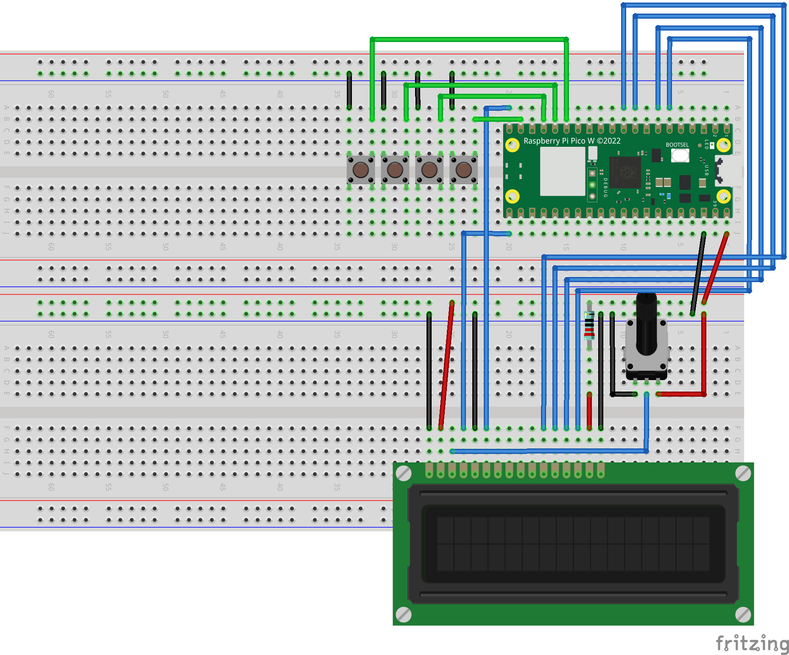

# **HEARTPROJECT**

An advanced modular system for managing a 16x2 LCD display, navigable menus, and LED animations using a Raspberry Pi Pico 2W (Arduino framework). The project is built with PlatformIO and VS Code, designed for scalability and easy feature integration. This project has been developed with the invaluable assistance of ChatGPT 🤖, which provided guidance, support, and inspiration throughout the development process.

---

## **Schematics**



---

## **Features** ✨

- **Dynamic Menu System:** 📋

  - Supports nested submenus and parent navigation.
  - Smooth button interaction with built-in debounce handling.

- **Custom Utility Classes:** 🛠️

  - Lightweight `SimpleVector` for dynamic storage.

- **Hardware Controllers:** ⚙️

  - `LCDController` for managing 16x2 LCD displays.
  - Future-ready `LEDController` for LED animations and controls.
  - Designed and tested specifically for Raspberry Pi Pico 2W hardware.

- **PlatformIO Integration:** 🚀
  - Build, upload, and debug the project seamlessly using PlatformIO.

---

## **Project Structure** 📂

```
< HEARTPROJECT
    include                   // Public headers for all components
        LCDController.h       // LCD controller interface
        Menu.h                // Menu system interface
        SimpleVector.h        // Utility class for dynamic storage
        LEDController.h       // LED control interface (future)
    src                       // Main source files
        main.cpp              // Main application entry point
        core                  // Core logic and utilities
            Menu.cpp          // Menu logic implementation
            SimpleVector.cpp  // Utility for dynamic storage
            LEDController.cpp // Future LED controller logic
        Controller            // Hardware interaction modules
            LCDController.cpp // LCD hardware interaction logic
    test                      // Unit tests for project components
    docs                      // Documentation and additional guides
        architecture.md       // Details about project architecture
        how_to_use_menu.md    // Instructions for using the menu system
    README.md                 // Project documentation
    platformio.ini            // PlatformIO configuration
```

---

## **Setup** 🛠️

1. **Clone the Repository**

   ```bash
   git clone https://github.com/djredflame/heart_project.git
   cd heartproject
   ```

2. **Open in VS Code**

   ```bash
   code .
   ```

3. **Install PlatformIO**

   - Open the **Extensions** view in VS Code (`Ctrl+Shift+X` or `Cmd+Shift+X` on macOS).
   - Search for "PlatformIO IDE" and install it.

4. **Build and Upload**
   - Connect your Raspberry Pi Pico 2W via USB (hold BOOTSEL if necessary on first upload).
   - Ensure that you've selected the correct board in `platformio.ini` (e.g., `board = raspberry-pi-pico-w`).
   - Build and upload the project:
     ```bash
     pio run --target upload
     ```

---

## **Usage** 🎮

1. **Start the Project**

   - Power the Raspberry Pi Pico 2W to display the main menu on the LCD.

2. **Navigation**
   - **Next (Button 14):** Move to the next menu item. ➡️
   - **Previous (Button 11):** Move to the previous menu item. ⬅️
   - **Select (Button 13):** Enter the selected submenu (if available). ✅
   - **Back (Button 12):** Return to the parent menu. 🔙

---

## **Documentation** 📚

Detailed documentation is available in the `docs` folder:

- [Project Architecture](./docs/architecture.md): Detailed overview of the system's structure and logic.
- [How to Use the Menu System](./docs/how_to_use_menu.md): Step-by-step usage guide.
- [Pico 2W Pinout PDF](./docs/Raspberry/pico-2-w-pinout.pdf): Pico 2W Pinout logic

---

## **Future Additions** 🔮

- **LED Animations:**

  - Implementing advanced LED animations and patterns using `LEDController`. 💡

- **Infrared Control:**

  - Adding support for infrared remote control functionalities. 📡

- **Ultrasonic Sensor Integration:**

  - Supporting distance measurement and interaction via ultrasonic sensors. 📏

- **Bluetooth Communication:**

  - Enabling Bluetooth-based interaction for remote control and monitoring. 📶

- **Mobile App Integration:**
  - Adding controls and visualization through a mobile app. 📱

---

## **Resources** 🔗

- [PlatformIO Documentation](https://docs.platformio.org/)
- [Arduino Reference](https://www.arduino.cc/reference/en/)
- [LiquidCrystal Library](https://www.arduino.cc/en/Reference/LiquidCrystal)

---

## **License** 📜

This project is licensed under the MIT License. See the LICENSE file for more details.

---

This project was created with significant support and collaboration with ChatGPT 🤖, ensuring innovative solutions and a seamless development experience.

Now optimized for Raspberry Pi Pico 2W development. 🚀
